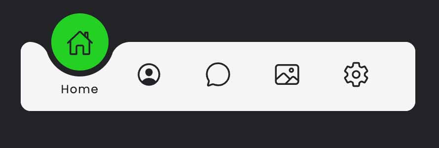

# Stunning Menu

This menu was made with HTML, CSS and Javascript.

I used <a href="https://ionic.io/ionicons/usage"><b>"Ionic Icons"</b></a> and <a href="https://fonts.google.com/specimen/Poppins"><b>"Poppins"</b></a> Font.

## Result

## Live View

<a href="https://qbixmex.github.io/stunning-menu/">check in live view</a>
